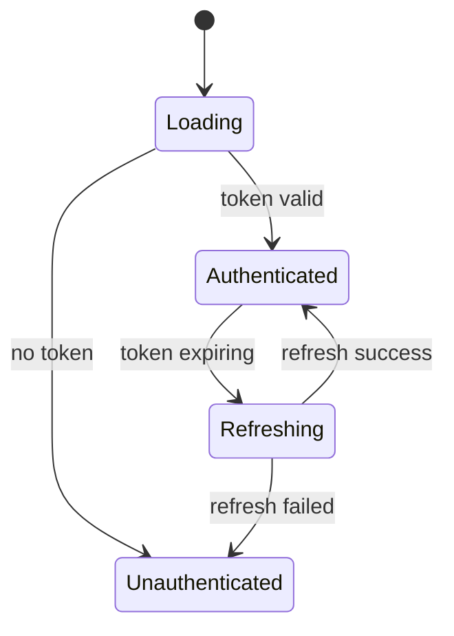

# Agent-Efficient Formats

Specs are consumed by AI agents, not just humans. Optimize for low tokens and explicit relationships.

## High-Density Formats

| Format | Approx Tokens | Why Agent-Friendly |
|---|---|---|
| **Mermaid diagrams** | ~50 | Explicit relationships, parseable structure |
| **TypeScript interfaces** | ~30 | Literal contracts, no inference needed |
| **Tables** | ~40 | Explicit column-to-row mapping |
| **Checklists** | ~20 | Binary pass/fail, scannable |
| **ASCII trees** | ~30 | Parseable hierarchy |
| **Error code tables** | ~40 | Code-to-message-to-fix mapping |

## Anti-Patterns (Token-Heavy, Inference-Heavy)

| Pattern | Problem | Fix |
|---|---|---|
| **Hedging prose** | "typically", "might", "could" require inference | Use MUST/SHOULD/MAY |
| **Narrative flow** | Buries relationships in sentences | Extract to table or diagram |
| **Implicit context** | "as mentioned above" -- agent may lack context | Repeat or link explicitly |
| **Long paragraphs** | High tokens, low density | Break into bullets or table |
| **Examples without contracts** | Agent may over-fit to example | Lead with interface, example follows |

## Token Efficiency Comparison

### Prose (200 tokens):

```
The session sync component should typically use BroadcastChannel
when it's available, which is the case in Chrome 54 and later,
Firefox 38 and later, and Safari 15.4 and later. When BroadcastChannel
is not available, it should fall back to using localStorage events...
```

### Table (40 tokens):

| Browser | BroadcastChannel | Fallback |
|---|---|---|
| Chrome 54+ | Yes | N/A |
| Firefox 38+ | Yes | N/A |
| Safari 15.4+ | Yes | N/A |
| Older | No | localStorage events |

Same information, 5x fewer tokens, zero ambiguity.

## Mermaid Diagram Types

| Diagram Type | Best For | Example Use |
|---|---|---|
| `graph TD` | Data flow, component relationships | Package structure, dependency graph |
| `sequenceDiagram` | API calls, auth flows, multi-step processes | Login flow, webhook processing |
| `classDiagram` | Type hierarchies, interface relationships | Domain model, adapter pattern |
| `stateDiagram-v2` | State machines, status transitions | Session lifecycle, order status |

### Example: State Diagram



A single diagram often replaces 50+ lines of prose. Flag as IMPROVEMENT if a spec lacks diagrams for component relationships, multi-step flows, or state machines.

## Prose Anti-Patterns to Flag

| Anti-Pattern | Evidence | Suggested Fix |
|---|---|---|
| **Hedging prose** | "typically", "might", "could", "generally" | Replace with MUST/SHOULD/MAY |
| **Narrative paragraphs** | 5+ sentence paragraphs explaining relationships | Extract to table or Mermaid diagram |
| **Implicit references** | "as mentioned above", "see previous section" | Repeat key info or add explicit link |
| **Repeated information** | Same constraint stated 3+ times in prose | Consolidate into single table row |
| **Examples without contracts** | Code example with no preceding interface | Add interface definition first |
