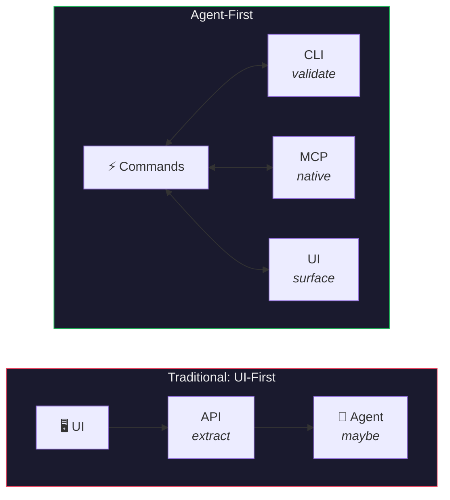
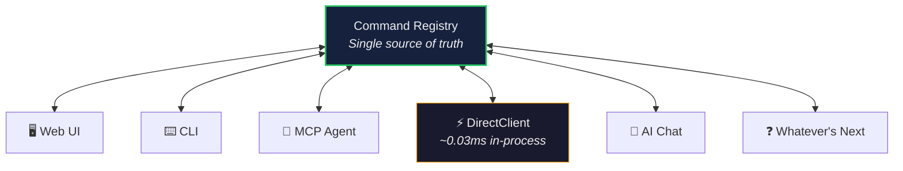
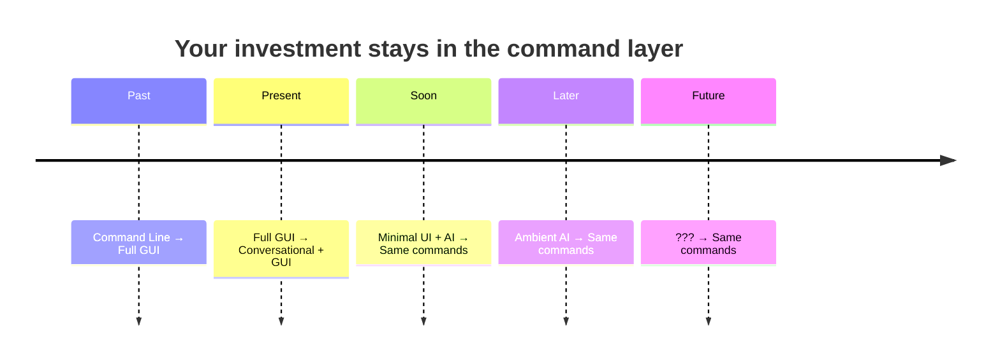

# AFD — Agent-First Development

[](LICENSE)
[](#)
[](https://github.com/lushly-dev/afd/releases)
[](#)
[](#)
[](#)
[](#)
[](#)
[](https://github.com/lushly-dev/botcore)
[](https://github.com/sponsors/Falkicon)

> 🟢 **Beta** · Stable and in active use across multiple projects. APIs are mostly stable; expect targeted iterative improvements. Feedback welcome!

> **Reference pair:** AFD defines command-first architecture patterns; botcore provides the shared bot infrastructure and skills used to operate those patterns at scale. See https://github.com/lushly-dev/botcore.

**What if we applied UX design thinking to AI agents?**

For decades, UX designers have reduced friction between people and software. Every button, menu and form is friction. Necessary friction, thoughtfully designed, but friction all the same. The ideal interface is *invisible*.

AI agents don't need visual affordances. They need clear capabilities. Structured inputs. Predictable outputs. And rich feedback when things go wrong. AFD applies the same rigor designers bring to human experiences, but pointed at the agents working alongside us.

The result: software where **commands are the product**, portable across any environment, with UI as a swappable surface. Humans and agents share the same language.

---

## The Problem: Your App Is Opaque to AI

Traditional applications are perfectly usable by humans and nearly opaque to machines. An LLM with terminal access is like a brilliant engineer forced to interact through a keyhole. It can read your code, but it can't *experience* your application.

Capabilities are locked behind visual interfaces. State lives in UI components. Features only work through mouse clicks. And when you finally build an API, it's a translation layer, a second-class view of what the UI already does.


```mermaid
graph LR
    subgraph Traditional["Traditional: UI-First"]
        direction LR
        UI["🖥️ UI"] --> API["API<br/><em>extract</em>"]
        API --> Agent["🤖 Agent<br/><em>maybe</em>"]
    end

    subgraph AFD["Agent-First"]
        direction LR
        CMD["⚡ Commands"] <--> CLI["CLI<br/><em>validate</em>"]
        CMD <--> MCP["MCP<br/><em>native</em>"]
        CMD <--> Surface["UI<br/><em>surface</em>"]
    end

    style Traditional fill:#1a1a2e,stroke:#e94560,color:#eee
    style AFD fill:#1a1a2e,stroke:#22c55e,color:#eee
```

## The Inversion: Commands Are the Product

AFD flips the development model. Define commands first. Validate them through the CLI. *Then* build UI as a thin surface over proven logic. The command layer is the single source of truth, and the UI is just one possible rendering.

> **The Honesty Check:** *"If it can't be done via CLI, the architecture is wrong."*

This one rule prevents UI-only code paths, forces proper abstraction, and gives agents 100% functional parity with humans.


```mermaid
graph TB
    CMD["Command Registry<br/><em>Single source of truth</em>"]

    CMD <--> UI["🖥️ Web UI"]
    CMD <--> CLI["⌨️ CLI"]
    CMD <--> MCP["🤖 MCP Agent"]
    CMD <--> DC["⚡ DirectClient<br/><em>~0.03ms in-process</em>"]
    CMD <--> Chat["💬 AI Chat"]
    CMD <--> Future["❓ Whatever's Next"]

    style CMD fill:#16213e,stroke:#22c55e,stroke-width:2px,color:#eee
    style DC fill:#1a1a2e,stroke:#f59e0b,color:#eee
```

A React app, a CLI session, an MCP agent, an in-process LLM. They all call the same commands, get the same `CommandResult`, and benefit from the same validation, error recovery and observability.

Because commands carry no UI dependency, they're portable. The same command set can run on a cloud server, a mobile app, an IoT device, or a self-service kiosk. You write the logic once and swap the surface for each environment. The business logic travels with the commands, not the presentation layer.

## What Makes This Different

Most tools give agents data. AFD gives agents **judgment**.

Here's the same operation — fetching a user — from a typical MCP tool versus an AFD command. Look at what the agent has to work with in each case:

**Typical MCP tool response:**
```json
{
  "id": 42,
  "name": "Jane Doe",
  "email": "jane@example.com",
  "role": "admin"
}
```

The agent got data. But now it's on its own. Was the lookup reliable? Is this from a cache or a live query? Should it do something next? If the user wasn't found, it gets a generic error string and has to guess what went wrong. Every decision after this response requires the agent to *infer* context the system already had.

**AFD command response:**
```json
{
  "success": true,
  "data": {
    "id": 42,
    "name": "Jane Doe",
    "email": "jane@example.com",
    "role": "admin"
  },
  "confidence": 0.85,
  "reasoning": "Matched by email (case-insensitive). 2 accounts share this domain.",
  "warnings": [{ "message": "User has elevated privileges — mutations require confirmation" }],
  "suggestions": ["Use user-permissions to review role assignments"]
}
```

Same data. Completely different agent experience. Now the agent knows:

| Metadata | What the agent learns |
|----------|----------------------|
| `confidence: 0.85` | "This match isn't certain — I should verify before acting on it" |
| `reasoning` | "It matched by email, not exact ID — and there are similar accounts" |
| `warnings` | "This is an admin user — I need to be careful with mutations" |
| `suggestions` | "There's a logical next step the system is recommending" |

And when things fail, the difference is even more dramatic:

```json
{
  "success": false,
  "error": {
    "code": "NOT_FOUND",
    "message": "No user with email 'jdoe@example.com'",
    "suggestion": "Use user-search with partial match — try 'jane' or 'doe'"
  }
}
```

Instead of a 404 and a blank wall, the agent gets a specific recovery path. It doesn't have to reason about *what to try next* — the system already knows.

This is `CommandResult`:

```typescript
interface CommandResult<T> {
  success: boolean;
  data?: T;
  error?: CommandError;

  confidence?: number;      // Should the agent trust this result?
  reasoning?: string;       // What happened and why?
  suggestions?: string[];   // What should the agent do next?
  warnings?: Warning[];     // Side effects to be aware of
  sources?: Source[];       // Where did this data come from?
  plan?: PlanStep[];        // What steps were or will be taken?
  alternatives?: T[];       // What other options exist?
}
```

Confidence calibration, transparency, plan visibility, actionable error recovery — the same principles that build trust in human UX, expressed as structured data that agents can act on. Not "API-first with a new name." A fundamentally different contract between your software and the agents using it.

## Riding the Wave

The interaction paradigm keeps changing. The command layer doesn't.


```mermaid
timeline
    title Your investment stays in the command layer
    Past : Command Line → Full GUI
    Present : Full GUI → Conversational + GUI
    Soon : Minimal UI + AI → Same commands
    Later : Ambient AI → Same commands
    Future : ??? → Same commands
```

By designing for agents first, your software automatically becomes API-first (agents need APIs), well-documented (agents need schemas), testable (agents need predictable behavior), and automatable (agents *are* automation). You're not betting on a specific protocol. MCP is today's standard, function calling is another, and future protocols will emerge. The command layer outlasts all of them.

## What's in the Toolkit

AFD ships as packages across **TypeScript, Python, and Rust**, all sharing the same `CommandResult` contract:

| Package | What it does |
|---------|-------------|
| **@afd/core** | Core types — `CommandResult`, `CommandError`, batching, streaming |
| **@afd/server** | Zod-based MCP server factory with middleware (logging, timing, rate limiting, telemetry) |
| **@afd/client** | MCP client with SSE/HTTP transports + `DirectClient` for ~0.03ms in-process execution |
| **@afd/testing** | JTBD scenario runner, surface validation, coverage analysis, MCP agent integration |
| **@afd/cli** | CLI for connecting, calling, validating, and exploring commands |
| **@afd/auth** | Provider-agnostic auth adapter — middleware, commands, session sync, React hooks, adapters for Mock/Convex/BetterAuth |
| **@afd/adapters** | Frontend adapters for rendering `CommandResult` → styled HTML with CSS variable theming |
| **afd** *(Python)* | Pydantic-based `CommandResult`, FastMCP server, decorator-based command definition |
| **afd** *(Rust)* | `CommandResult` types, `CommandRegistry`, batch/stream support, WASM-compatible |

Features like [command trust config](./docs/features/complete/command-trust-config/), [exposure & undo](./docs/features/complete/command-exposure-undo/), [command pipelines](./docs/features/complete/command-pipeline/), [real-time handoff](./docs/features/complete/handoff-pattern/), and [middleware defaults](./docs/features/complete/middleware-defaults/) (zero-config observability) are already shipped. TypeSpec-based [cross-layer contract sync](./.claude/skills/afd-contracts/SKILL.md) prevents schema drift between codebases.

**[Read the full philosophy →](./.claude/skills/afd-developer/references/philosophy.md)**

## Development Workflow

**Per-Command Workflow** (repeat for each feature):

```
┌─────────────────────────────────────────────────┐
│  Step 1: DEFINE                                 │
│  • Create command with schema                   │
│  • Register in command registry                 │
│  • Document inputs, outputs, side effects       │
├─────────────────────────────────────────────────┤
│  Step 2: VALIDATE                               │
│  • Test via CLI: afd call <command>             │
│  • Cover edge cases and error states            │
│  • Add automated tests (Vitest)                 │
│  • Do NOT proceed until CLI works            │
├─────────────────────────────────────────────────┤
│  Step 3: SURFACE                                │
│  • Build UI component that invokes command      │
│  • UI is a thin wrapper, not business logic     │
│  • Integration test (Playwright)                │
└─────────────────────────────────────────────────┘
```

> **Note**: This is the per-command workflow. For the full 4-phase **project implementation roadmap** (Foundation → Expansion → Refinement → Ecosystem), see [Implementation Phases](./.claude/skills/afd-developer/references/implementation-phases.md).

## Getting Started

### Installation

```bash
# From source (private repo)
cd afd
pnpm install
pnpm build
node packages/cli/dist/bin.js --help
```

### Connect to an MCP Server

```bash
# Connect to a running MCP server
afd connect http://localhost:3100/sse

# List available commands
afd tools

# Call a command
afd call document.create '{"title": "Test"}'
```

### Validate Your Commands

```bash
# Run validation suite
afd validate

# Validate specific category
afd validate --category document
```

## CLI Reference

| Command | Description |
|---------|-------------|
| `afd connect <url>` | Connect to an MCP server |
| `afd disconnect` | Disconnect from server |
| `afd status` | Show connection status |
| `afd tools` | List available tools |
| `afd tools --category <name>` | Filter tools by category |
| `afd call <tool> [args]` | Call a tool with JSON args |
| `afd validate` | Run per-command validation |
| `afd validate --surface` | Run cross-command surface validation |
| `afd shell` | Interactive mode |

## Documentation

| Guide | Description |
|-------|-------------|
| [Philosophy](./.claude/skills/afd-developer/references/philosophy.md) | **Why** AFD — UX design for AI collaborators |
| [Command Schema Guide](./.claude/skills/afd/references/command-schema.md) | How to design commands that enable good agent UX |
| [Trust Through Validation](./.claude/skills/afd-developer/references/trust-validation.md) | How CLI validation builds user trust |
| [Implementation Phases](./.claude/skills/afd-developer/references/implementation-phases.md) | 4-phase roadmap for AFD projects |
| [Production Considerations](./.claude/skills/afd-developer/references/production-considerations.md) | Security, mutation safety, and observability guidance |

## Examples

| Example | Description |
|---------|-------------|
| [Todo App](./packages/examples/todo) | Multi-stack example with 3 backends (TypeScript, Python, Rust) and 2 frontends (Vanilla JS, React). Features shared storage, trust UI, remote change detection, and full MCP integration |

## Testing

Testability is built in at every layer. Run the full suite:

```bash
pnpm test
```

### Test Categories

| Category | Purpose | Location |
|----------|---------|----------|
| **Unit Tests** | Command logic correctness | `**/commands/__tests__/commands.test.ts` |
| **Performance Tests** | Response time baselines | `**/commands/__tests__/performance.test.ts` |
| **AFD Compliance** | CommandResult structure validation | Included in unit tests |
| **Surface Validation** | Cross-command semantic quality analysis | `afd validate --surface` |

### Performance Testing

Performance tests catch regressions by comparing against baselines:

```bash
# Run with performance summary
pnpm test

# Example output:
# Performance Summary
# Command             Duration    Threshold   Status
# todo.create         0.85ms      10ms        ✓
# todo.list           8.7ms       20ms        ✓
```

Commands run in isolation (no network, no database) to measure pure business logic performance. See the Todo example for patterns.

## Roadmap

- [x] Methodology documentation
- [x] Command schema guide
- [x] Trust framework documentation
- [x] Implementation phases guide
- [x] CLI tool (`@afd/cli`)
- [x] MCP client library (`@afd/client`)
- [x] MCP server library (`@afd/server`)
- [x] Core types (`@afd/core`)
- [x] Testing utilities (`@afd/testing`)
- [x] Example implementations
- [x] Performance testing framework
- [ ] VS Code extension
- [x] npm publish

## Community

- Read [CONTRIBUTING.md](./CONTRIBUTING.md) before opening a PR
- Review [CODE_OF_CONDUCT.md](./CODE_OF_CONDUCT.md) for community expectations
- Report vulnerabilities via [SECURITY.md](./SECURITY.md)

For AI agents contributing to this repo, see [AGENTS.md](AGENTS.md).

## Author

**Jason Falk** · [GitHub](https://github.com/Falkicon) · [Sponsor](https://github.com/sponsors/Falkicon)

Principal Design & UX Engineering Leader at Microsoft. Currently manages the central design team for Azure Data (including Microsoft Fabric) and leads AI adoption across the studio. Design Director for Microsoft Fabric through its v1 launch. Co-creator of [FAST](https://github.com/microsoft/fast) (7,400+ GitHub stars), an open-source web component system used in Edge, Windows, VS Code, and .NET.

AFD grew from 30 years of building interfaces — and the realization that the most durable layer isn't the UI, it's the commands underneath.
