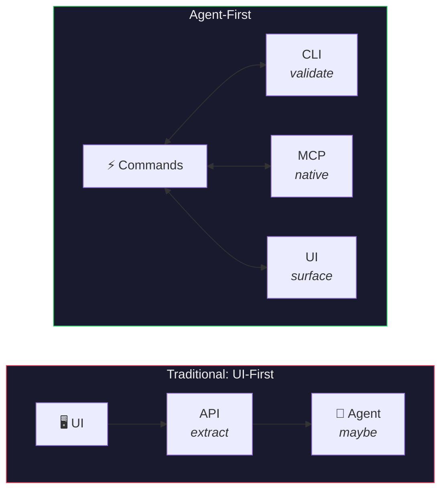
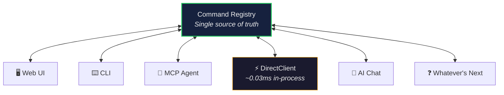
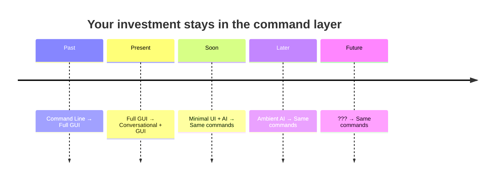

# AFD — Agent-First Development

[](LICENSE)
[](#)
[](#)
[](#)
[](#)
[](#)
[](#)
[](https://github.com/lushly-dev/botcore)
[](https://github.com/sponsors/Falkicon)

| Implementation | Package | Latest release | Status | Contract |
|---|---|---|---|---|
| TypeScript | [`@lushly-dev/afd-core`](https://www.npmjs.com/package/@lushly-dev/afd-core) and 8 more `@lushly-dev/*` packages | [](https://www.npmjs.com/package/@lushly-dev/afd-core) | 🟢 Beta | [1.0-rc](./spec/CHANGELOG.md) |
| Python | [`afd`](https://pypi.org/project/afd/) | [](https://pypi.org/project/afd/) | 🟢 Beta | [1.0-rc](./spec/CHANGELOG.md) |
| Rust | [`afd`](./packages/rust) crate | Not on crates.io yet | 🟡 Preview | [1.0-rc](./spec/CHANGELOG.md) |
| C++ | [`afd-cpp`](./packages/cpp) | [](https://github.com/lushly-dev/afd/tags) | 🟡 Preview | [1.0-rc](./spec/CHANGELOG.md) |

<!-- Once the crate is published, replace "Not on crates.io yet" with
[](https://crates.io/crates/afd) -->

> 🟢 **Beta:** stable and in active use across multiple projects. APIs are mostly stable; expect targeted iterative improvements. 🟡 **Preview:** tested, but not yet proven in production; the API may change in a minor release before 1.0. **Contract** is the version of the shared AFD contract in [`spec/`](./spec/CHANGELOG.md) that each implementation implements; each package keeps its own version. Feedback welcome!

> **Reference pair:** AFD defines command-first architecture patterns; botcore provides the shared bot infrastructure and skills used to operate those patterns at scale. See https://github.com/lushly-dev/botcore.

**What if we applied UX design thinking to AI agents?**

For decades, UX designers have reduced friction between people and software. Every button, menu and form is friction. Necessary friction, thoughtfully designed, but friction all the same. The ideal interface is *invisible*.

AI agents don't need visual affordances. They need clear capabilities. Structured inputs. Predictable outputs. And rich feedback when things go wrong. AFD applies the same rigor designers bring to human experiences, but pointed at the agents working alongside us.

The result: software where **commands are the product**, portable across any environment, with UI as a swappable surface. Humans and agents share the same language.

---

## The Problem: Your App Is Opaque to AI

Traditional applications are perfectly usable by humans and nearly opaque to machines. An LLM with terminal access is like a brilliant engineer forced to interact through a keyhole. It can read your code, but it can't *experience* your application.

Capabilities are locked behind visual interfaces. State lives in UI components. Features only work through mouse clicks. And when you finally build an API, it's a translation layer, a second-class view of what the UI already does.


```mermaid
graph LR
    subgraph Traditional["Traditional: UI-First"]
        direction LR
        UI["🖥️ UI"] --> API["API<br/><em>extract</em>"]
        API --> Agent["🤖 Agent<br/><em>maybe</em>"]
    end

    subgraph AFD["Agent-First"]
        direction LR
        CMD["⚡ Commands"] <--> CLI["CLI<br/><em>validate</em>"]
        CMD <--> MCP["MCP<br/><em>native</em>"]
        CMD <--> Surface["UI<br/><em>surface</em>"]
    end

    style Traditional fill:#1a1a2e,stroke:#e94560,color:#eee
    style AFD fill:#1a1a2e,stroke:#22c55e,color:#eee
```

## The Inversion: Commands Are the Product

AFD flips the development model. Define commands first. Validate them through the CLI. *Then* build UI as a thin surface over proven logic. The command layer is the single source of truth, and the UI is just one possible rendering.

> **The Honesty Check:** *"If it can't be done via CLI, the architecture is wrong."*

This one rule prevents UI-only code paths, forces proper abstraction, and gives agents 100% functional parity with humans.


```mermaid
graph TB
    CMD["Command Registry<br/><em>Single source of truth</em>"]

    CMD <--> UI["🖥️ Web UI"]
    CMD <--> CLI["⌨️ CLI"]
    CMD <--> MCP["🤖 MCP Agent"]
    CMD <--> DC["⚡ DirectClient<br/><em>~0.03ms in-process</em>"]
    CMD <--> Chat["💬 AI Chat"]
    CMD <--> Future["❓ Whatever's Next"]

    style CMD fill:#16213e,stroke:#22c55e,stroke-width:2px,color:#eee
    style DC fill:#1a1a2e,stroke:#f59e0b,color:#eee
```

A React app, a CLI session, an MCP agent, an in-process LLM. They all call the same commands, get the same `CommandResult`, and benefit from the same validation, error recovery and observability.

Because commands carry no UI dependency, they're portable. The same command set can run on a cloud server, a mobile app, an IoT device, or a self-service kiosk. You write the logic once and swap the surface for each environment. The business logic travels with the commands, not the presentation layer.

## What Makes This Different

Most tools give agents data. AFD gives agents **judgment**.

Here's the same operation — fetching a user — from a typical MCP tool versus an AFD command. Look at what the agent has to work with in each case:

**Typical MCP tool response:**
```json
{
  "id": 42,
  "name": "Jane Doe",
  "email": "jane@example.com",
  "role": "admin"
}
```

The agent got data. But now it's on its own. Was the lookup reliable? Is this from a cache or a live query? Should it do something next? If the user wasn't found, it gets a generic error string and has to guess what went wrong. Every decision after this response requires the agent to *infer* context the system already had.

**AFD command response:**
```json
{
  "success": true,
  "data": {
    "id": 42,
    "name": "Jane Doe",
    "email": "jane@example.com",
    "role": "admin"
  },
  "confidence": 0.85,
  "reasoning": "Matched by email (case-insensitive). 2 accounts share this domain.",
  "warnings": [{ "message": "User has elevated privileges — mutations require confirmation" }],
  "suggestions": ["Use user-permissions to review role assignments"]
}
```

Same data. Completely different agent experience. Now the agent knows:

| Metadata | What the agent learns |
|----------|----------------------|
| `confidence: 0.85` | "This match isn't certain — I should verify before acting on it" |
| `reasoning` | "It matched by email, not exact ID — and there are similar accounts" |
| `warnings` | "This is an admin user — I need to be careful with mutations" |
| `suggestions` | "There's a logical next step the system is recommending" |

And when things fail, the difference is even more dramatic:

```json
{
  "success": false,
  "error": {
    "code": "NOT_FOUND",
    "message": "No user with email 'jdoe@example.com'",
    "suggestion": "Use user-search with partial match — try 'jane' or 'doe'"
  }
}
```

Instead of a 404 and a blank wall, the agent gets a specific recovery path. It doesn't have to reason about *what to try next* — the system already knows.

This is `CommandResult`:

```typescript
interface CommandResult<T> {
  success: boolean;
  data?: T;
  error?: CommandError;

  confidence?: number;      // Should the agent trust this result?
  reasoning?: string;       // What happened and why?
  suggestions?: string[];   // What should the agent do next?
  warnings?: Warning[];     // Side effects to be aware of
  sources?: Source[];       // Where did this data come from?
  plan?: PlanStep[];        // What steps were or will be taken?
  alternatives?: T[];       // What other options exist?
}
```

Confidence calibration, transparency, plan visibility, actionable error recovery — the same principles that build trust in human UX, expressed as structured data that agents can act on. Not "API-first with a new name." A fundamentally different contract between your software and the agents using it.

## Riding the Wave

The interaction paradigm keeps changing. The command layer doesn't.


```mermaid
timeline
    title Your investment stays in the command layer
    Past : Command Line → Full GUI
    Present : Full GUI → Conversational + GUI
    Soon : Minimal UI + AI → Same commands
    Later : Ambient AI → Same commands
    Future : ??? → Same commands
```

By designing for agents first, your software automatically becomes API-first (agents need APIs), well-documented (agents need schemas), testable (agents need predictable behavior), and automatable (agents *are* automation). You're not betting on a specific protocol. MCP is today's standard, function calling is another, and future protocols will emerge. The command layer outlasts all of them.

## What's in the Toolkit

AFD ships as packages across **TypeScript, Python, Rust, and C++**. All four share the wire contract (`spec/wire`) and pass the same todo conformance suite. Their language-specific APIs differ, and so does their scope. TypeScript and Python include MCP servers and clients; Rust and C++ are in-process libraries. See [Language Parity](./docs/language-parity.md) for the capability matrix and known gaps.

| Package | What it does |
|---------|-------------|
| **@lushly-dev/afd-core** | Core types — `CommandResult`, `CommandError`, batching, streaming |
| **@lushly-dev/afd-server** | Zod-based MCP server factory with middleware (logging, timing, rate limiting, telemetry) |
| **@lushly-dev/afd-client** | MCP client with SSE/HTTP transports + `DirectClient` for ~0.03ms in-process execution |
| **@lushly-dev/afd-testing** | JTBD scenario runner, surface validation, coverage analysis, MCP agent integration |
| **@lushly-dev/afd-cli** | CLI for connecting, calling, validating, and exploring commands |
| **@lushly-dev/afd-auth** | Provider-agnostic auth adapter — middleware, commands, session sync, React hooks, adapters for Mock/Convex/BetterAuth |
| **@lushly-dev/afd-adapters** | Frontend adapters for rendering `CommandResult` → styled HTML with CSS variable theming |
| **afd** *(Python)* | Idiomatic Python AFD: `CommandResult`, MCP server/client, middleware, validation, telemetry, batch, pipelines, stream types, testing, handoff |
| **afd** *(Rust)* | `CommandResult` types, validating `CommandRegistry`, batch and pipeline execution, stream types, bootstrap commands; WASM-compatible; no MCP server yet |
| **afd-cpp** *(C++20, pre-release)* | [`packages/cpp`](./packages/cpp): `CommandResult` types, validating `CommandRegistry`, middleware, `DirectClient`, batch/pipeline/stream execution; engine-free, builds without exceptions or RTTI and for WebAssembly |

AFD stays framework-agnostic at the command layer. React or browser integrations belong in examples and ecosystem layers, not in the core parity target.

Features like [command trust config](./docs/features/complete/command-trust-config/), [exposure & undo](./docs/features/complete/command-exposure-undo/), [command pipelines](./docs/features/complete/command-pipeline/), [real-time handoff](./docs/features/complete/handoff-pattern/), and [middleware defaults](./docs/features/complete/middleware-defaults/) (zero-config observability) are already shipped. TypeSpec-based [cross-layer contract sync](./.claude/skills/afd-contracts/SKILL.md) prevents schema drift between codebases.

**[Read the full philosophy →](./.claude/skills/afd-developer/references/philosophy.md)**

## Development Workflow

**Per-Command Workflow** (repeat for each feature):

```
┌─────────────────────────────────────────────────┐
│  Step 1: DEFINE                                 │
│  • Create command with schema                   │
│  • Register in command registry                 │
│  • Document inputs, outputs, side effects       │
├─────────────────────────────────────────────────┤
│  Step 2: VALIDATE                               │
│  • Test via CLI: afd call <command>             │
│  • Cover edge cases and error states            │
│  • Add automated tests (Vitest)                 │
│  • Do NOT proceed until CLI works            │
├─────────────────────────────────────────────────┤
│  Step 3: SURFACE                                │
│  • Build UI component that invokes command      │
│  • UI is a thin wrapper, not business logic     │
│  • Integration test (Playwright)                │
└─────────────────────────────────────────────────┘
```

> **Note**: This is the per-command workflow. For the full 4-phase **project implementation roadmap** (Foundation → Expansion → Refinement → Ecosystem), see [Implementation Phases](./.claude/skills/afd-developer/references/implementation-phases.md).

## Quickstart

Five minutes from an empty folder to a command that a terminal, a test and an agent can all call. You need Node.js 22.12 or later.

> **Note:** these steps use the 2.0 packages. Until npm serves 2.x, use the source-install option below. It links both the server and CLI, so `npx afd` runs the built CLI rather than the older published version, which can hang after `afd connect`.

### 1. Create a project

```bash
mkdir todo-afd && cd todo-afd
npm init -y && npm pkg set type=module
npm install -D tsx
```

When `npm view @lushly-dev/afd-cli version` and `npm view @lushly-dev/afd-server version` both print 2.x, install the published packages:

```bash
npm install @lushly-dev/afd-server@^2 @lushly-dev/afd-cli@^2 zod
```

Otherwise, with pnpm installed, build a source checkout inside the project and install its local packages:

```bash
git clone https://github.com/lushly-dev/afd.git .afd-source
pnpm --dir .afd-source install --frozen-lockfile
pnpm --dir .afd-source build
npm install ./.afd-source/packages/server ./.afd-source/packages/cli zod
```

Both routes make `npx afd --version` print 2.x. Keep the source checkout in place when using local packages; npm links to their built files. The rest of this walkthrough uses the same commands with either route.

### 2. Define commands and serve them

Create `server.ts`:

```typescript
import { createMcpServer, defineCommand, failure, success } from '@lushly-dev/afd-server';
import { z } from 'zod';

const todos = new Map<string, { id: string; title: string; done: boolean }>();

const createTodo = defineCommand({
  name: 'todo-create',
  description: 'Create a todo item from a title',
  category: 'todo',
  expose: { mcp: true, cli: true }, // remote surfaces are opt-in
  mutation: true,
  input: z.object({ title: z.string().min(1, 'Title is required') }),
  async handler({ title }) {
    const todo = { id: crypto.randomUUID().slice(0, 8), title, done: false };
    todos.set(todo.id, todo);
    return success(todo, { reasoning: `Created "${title}"`, confidence: 1 });
  },
});

const getTodo = defineCommand({
  name: 'todo-get',
  description: 'Get a todo item by its id',
  category: 'todo',
  expose: { mcp: true, cli: true },
  input: z.object({ id: z.string() }),
  async handler({ id }) {
    const todo = todos.get(id);
    if (!todo) {
      return failure({
        code: 'NOT_FOUND',
        message: `No todo with id "${id}"`,
        suggestion: 'Call todo-create first, then use the id it returns',
      });
    }
    return success(todo);
  },
});

const server = createMcpServer({
  name: 'todo',
  version: '0.1.0',
  commands: [createTodo, getTodo],
  transport: 'http',
  port: 3100,
});

await server.start();
console.log(`AFD server running at ${server.getUrl()}`);
```

Start it:

```bash
npx tsx server.ts
```

### 3. Validate from the terminal

In a second terminal, connect once, then call commands the way an agent would. Try the failure first:

```bash
npx afd connect http://localhost:3100/sse
npx afd call todo-create '{"title":""}'
```

```
✗ Failed

Error: [VALIDATION_ERROR] Input validation failed

Suggestion: title: Title is required. Expected fields: title
```

Then the happy path, and a lookup that fails with a recovery path:

```bash
npx afd call todo-create '{"title":"Buy groceries"}'
npx afd call todo-get '{"id":"nope"}'
```

```
✓ Success

Data:
{
  "id": "e9867058",
  "title": "Buy groceries",
  "done": false
}

Confidence: ██████████ 100%
```

```
✗ Failed

Error: [NOT_FOUND] No todo with id "nope"

Suggestion: Call todo-create first, then use the id it returns
```

`npx afd tools` shows what an MCP agent sees. By default commands are grouped by category, so both appear as one `todo` tool with `create` and `get` actions, next to the built-in `afd-call`, `afd-batch`, `afd-pipe` and `afd-detail` tools.

### 4. Test the job

Create `scenarios/todo-lifecycle.scenario.yaml`. Step 1 uses the id step 0 returned:

```yaml
name: Create and fetch a todo
description: As a user, I can create a todo and fetch it back
job: todo-lifecycle
tags: [smoke, step-refs]

steps:
  - command: todo-create
    description: Create a todo
    input: { title: Buy groceries }
    expect: { success: true }

  - command: todo-get
    description: Fetch it by the id step 0 returned
    input:
      id: ${{ steps[0].data.id }}
    expect:
      success: true
      data: { title: Buy groceries }
```

```bash
npx afd scenario run scenarios/ --server http://localhost:3100/sse
```

```
▸ todo-lifecycle
  As a user, I can create a todo and fetch it back
  ✓ [1/2] todo-create 3ms
  ✓ [2/2] todo-get 2ms

✓ todo-lifecycle (7ms)
  2 passed, 0 failed, 0 skipped

Summary
  1 passed, 0 failed

✓ All scenarios passed!
```

### 5. Lint the surface

Surface validation checks the command set the way an agent will meet it: names, descriptions, overlapping schemas, injection risks and schema complexity.

```bash
npx afd validate --surface
```

```
Surface Validation Results:

  Grouped tools expanded into their commands: todo
  Built-in AFD tools skipped: afd-batch, afd-pipe, afd-call, afd-detail

ℹ INFO (2):
  missing-output-schema: Command "todo-create" has no output schema — agents cannot predict response shape
    Commands: todo-create
  missing-output-schema: Command "todo-get" has no output schema — agents cannot predict response shape
    Commands: todo-get

Summary:
  2 commands analyzed
  12 rules evaluated in 2.02ms
  0 errors
  0 warnings
  2 info

✓ Surface validation passed!
```

It validates your commands, not AFD's built-in tools, and expands grouped tools into the commands inside them. The two info items are the next improvement: add an `output` schema to each command so agents know the result's shape before they call it.

### 6. Hand it to an agent

The server speaks MCP, so any MCP client can use it. In Claude Code:

```bash
claude mcp add --transport sse todo http://localhost:3100/sse
```

For an agent that runs inside your own app, skip the network: `createDirectRegistry` and DirectClient run the same commands in-process (see [afd-directclient](./.claude/skills/afd-directclient/SKILL.md)).

### Next steps

- **Teach your coding agent AFD:** `npx degit lushly-dev/afd/.claude/skills/afd .claude/skills/afd` (also `afd-typescript`, `afd-python`, `afd-rust` and others in [`.claude/skills`](./.claude/skills)).
- **Add agent-UX metadata:** `destructive` and `confirmPrompt`, `undoable`, `requires`, `examples` and output schemas. See the [command schema guide](./.claude/skills/afd/references/command-schema.md).
- **Scale the tool list:** `toolStrategy: 'lazy'` for large command sets, and `bootstrap: true` for `afd-help`, `afd-docs` and `afd-schema` ([MCP integration](./.claude/skills/afd/references/mcp-integration.md)).
- **Go deeper on linting:** the [surface validation guide](./.claude/skills/afd/references/surface-validation.md) covers every rule and how to configure them.
- **Build a UI on top:** call the same commands from the browser with `createClient` from `@lushly-dev/afd-client`.

### Working on AFD itself

To build the packages and CLI from source:

```bash
git clone https://github.com/lushly-dev/afd.git
cd afd
pnpm install    # Also installs Lefthook git hooks
pnpm build
node packages/cli/dist/bin.js --help
```

> `pnpm check` runs all quality gates (lint, typecheck, test, build) manually. See [CONTRIBUTING.md](./CONTRIBUTING.md).

## CLI Reference

| Command | Description |
|---------|-------------|
| `afd connect <url>` | Connect to an MCP server |
| `afd disconnect` | Disconnect from server |
| `afd status` | Show connection status |
| `afd tools` | List available tools |
| `afd tools --category <name>` | Filter tools by category |
| `afd call <tool> [args]` | Call a tool with JSON args |
| `afd validate` | Validate the tool listing (`--execute` also calls read-only tools) |
| `afd validate --surface` | Run cross-command surface validation |
| `afd shell` | Interactive mode |

## Documentation

| Guide | Description |
|-------|-------------|
| [Philosophy](./.claude/skills/afd-developer/references/philosophy.md) | **Why** AFD — UX design for AI collaborators |
| [Command Schema Guide](./.claude/skills/afd/references/command-schema.md) | How to design commands that enable good agent UX |
| [Optimistic Mutations](./.claude/skills/optimistic-mutations/SKILL.md) | How to use optimistic updates in interactive AFD clients without moving business logic out of commands |
| [Trust Through Validation](./.claude/skills/afd-developer/references/trust-validation.md) | How CLI validation builds user trust |
| [Implementation Phases](./.claude/skills/afd-developer/references/implementation-phases.md) | 4-phase roadmap for AFD projects |
| [Production Considerations](./.claude/skills/afd-developer/references/production-considerations.md) | Security, mutation safety, and observability guidance |

## Examples

| Example | Description |
|---------|-------------|
| [Todo App](./packages/examples/todo) | Multi-stack example with 4 backends (TypeScript, Python, Rust, C++) and 2 frontends (Vanilla JS, React). Features shared storage, trust UI, remote change detection, and full MCP integration |

## Testing

Testability is built in at every layer. Run the full suite:

```bash
pnpm test
```

### Test Categories

| Category | Purpose | Location |
|----------|---------|----------|
| **Unit Tests** | Command logic correctness | `**/commands/__tests__/commands.test.ts` |
| **Performance Tests** | Response time baselines | `**/commands/__tests__/performance.test.ts` |
| **AFD Compliance** | CommandResult structure validation | Included in unit tests |
| **Surface Validation** | Cross-command semantic quality analysis | `afd validate --surface` |

### Performance Testing

Performance tests catch regressions by comparing against baselines:

```bash
# Run with performance summary
pnpm test

# Example output:
# Performance Summary
# Command             Duration    Threshold   Status
# todo.create         0.85ms      10ms        ✓
# todo.list           8.7ms       20ms        ✓
```

Commands run in isolation (no network, no database) to measure pure business logic performance. See the Todo example for patterns.

## Roadmap

- [x] Methodology documentation
- [x] Command schema guide
- [x] Trust framework documentation
- [x] Implementation phases guide
- [x] CLI tool (`@lushly-dev/afd-cli`)
- [x] MCP client library (`@lushly-dev/afd-client`)
- [x] MCP server library (`@lushly-dev/afd-server`)
- [x] Core types (`@lushly-dev/afd-core`)
- [x] Testing utilities (`@lushly-dev/afd-testing`)
- [x] Example implementations
- [x] Performance testing framework
- [ ] VS Code extension
- [x] npm publish

## Community

- Read [CONTRIBUTING.md](./CONTRIBUTING.md) before opening a PR
- Review [CODE_OF_CONDUCT.md](./CODE_OF_CONDUCT.md) for community expectations
- Report vulnerabilities via [SECURITY.md](./SECURITY.md)

For AI agents contributing to this repo, see [AGENTS.md](AGENTS.md).

## Author

**Jason Falk** · [GitHub](https://github.com/Falkicon) · [Sponsor](https://github.com/sponsors/Falkicon)

Principal Design & UX Engineering Leader at Microsoft. Currently manages the central design team for Azure Data (including Microsoft Fabric) and leads AI adoption across the studio. Design Director for Microsoft Fabric through its v1 launch. Co-creator of [FAST](https://github.com/microsoft/fast) (7,400+ GitHub stars), an open-source web component system used in Edge, Windows, VS Code, and .NET.

AFD grew from 30 years of building interfaces — and the realization that the most durable layer isn't the UI, it's the commands underneath.
