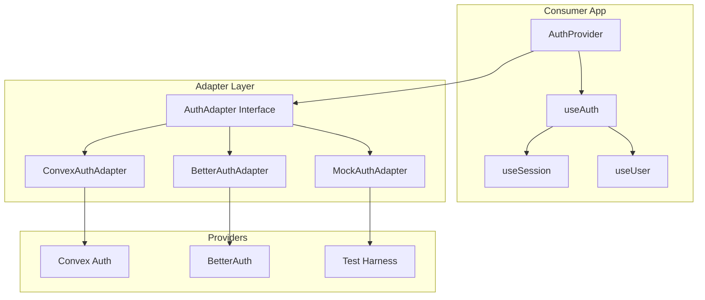
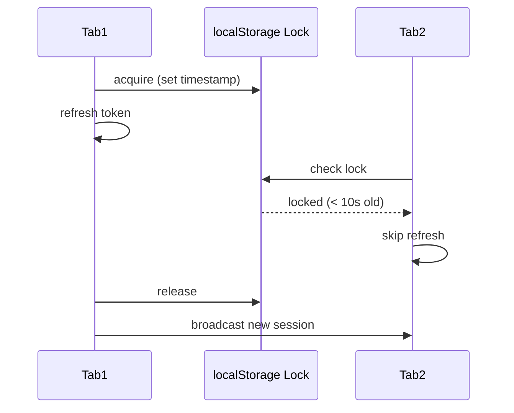

# Auth Adapter Specification

> Provider-agnostic authentication for AFD applications

---
status: in-progress
created: 2026-01-31
updated: 2026-01-31
proposal: [auth-adapter.proposal.md](./auth-adapter.proposal.md)
effort: M (3-5 days)
version: 2.2
---

## Overview

This spec defines `@lushly-dev/afd-auth`, a provider-agnostic authentication adapter using discriminated unions for type-safe session access.

**Strategy:** Use the adapter pattern to abstract authentication providers behind a common interface. Consumers check `status` before accessing `user` — TypeScript enforces this at compile time.

## Architecture



## Package Structure

```
packages/auth/src/
├── index.ts           # Public exports
├── types.ts           # AuthAdapter, AuthSessionState
├── errors.ts          # AuthAdapterError, error codes
├── session-sync.ts    # Multi-tab synchronization
├── adapters/
│   ├── convex.ts      # useConvexAuthAdapter()
│   ├── better-auth.ts # useBetterAuthAdapter()
│   └── mock.ts        # MockAuthAdapter (testing)
└── react/
    ├── context.ts     # AuthProvider
    └── hooks.ts       # useAuth, useSession, useUser
```

## Core Interface

### AuthSessionState (Discriminated Union)

```typescript
export type AuthSessionState =
  | { status: 'unauthenticated'; session: null; user: null }
  | { status: 'loading'; session: null; user: null }
  | { status: 'refreshing'; session: Session; user: User }
  | { status: 'authenticated'; session: Session; user: User };
```

| Status | `session` | `user` | When Emitted |
|--------|-----------|--------|-------------|
| `unauthenticated` | `null` | `null` | No valid token |
| `loading` | `null` | `null` | Initial load, checking token |
| `refreshing` | valid | valid | Custom adapters only (`supportsRefreshingState: true`) |
| `authenticated` | valid | valid | Token valid, user loaded |

**Consumer pattern:**
```typescript
const session = useSession();
if (session.status === 'authenticated') {
  console.log(session.user.email);  // TypeScript knows user exists
}
```

### AuthAdapter Interface

```typescript
export interface AuthAdapter {
  signIn(provider: Provider, options?: SignInOptions): Promise<void>;
  signOut(): Promise<void>;
  getSession(): Promise<AuthSessionState>;
  onAuthStateChange(callback: (state: AuthSessionState) => void): { unsubscribe: () => void };
  readonly supportsRefreshingState: boolean;
}
```

### Supporting Types

```typescript
export interface Session { id: string; expiresAt: Date; token: string; }
export interface User { id: string; email: string; name?: string; image?: string; }
export type Provider = 'github' | 'google' | 'email' | (string & {});

// SignIn options
export interface EmailCredentials { email: string; password?: string; }
export interface OAuthOptions { scopes?: string[]; redirectTo?: string; }
export type SignInOptions = EmailCredentials | OAuthOptions;
```

### Error Types

```typescript
export type AuthErrorCode =
  | 'INVALID_CREDENTIALS'
  | 'EXPIRED_SESSION'
  | 'PROVIDER_ERROR'
  | 'NETWORK_ERROR'
  | 'REFRESH_FAILED';

export class AuthAdapterError extends Error {
  constructor(public error: { code: AuthErrorCode; message: string; suggestion: string });
  static invalidCredentials(): AuthAdapterError;
  static expiredSession(): AuthAdapterError;
  static providerError(provider: string, details?: string): AuthAdapterError;
  static networkError(): AuthAdapterError;
}
```

## Adapter Contracts

| Adapter | Provider API | Requirements |
|---------|--------------|-------------|
| **ConvexAuthAdapter** | `@convex-dev/auth/react` | MUST use `useAuthToken()` + `useAuthActions()`. MUST require `meQuery` option. MUST return synthetic session. MUST emit dev warning for synthetic `expiresAt`. |
| **BetterAuthAdapter** | `better-auth/react` | MUST use `client.useSession()` hook. MUST bridge nanostore to callback. MUST support social + email sign-in. |
| **MockAuthAdapter** | Test harness | MUST start `unauthenticated`. MUST provide `_reset()`, `_setUser()`, `_setLoading()`, `_triggerError()`. SHOULD support configurable delays. |

All built-in adapters MUST set `supportsRefreshingState: false`.

## React Integration

### Hooks

| Hook | Returns | Purpose |
|------|---------|---------|
| `useAuth()` | `AuthAdapter` | Access adapter for signIn/signOut |
| `useSession()` | `AuthSessionState` | Reactive session with type narrowing |
| `useUser()` | `User \| null` | Convenience accessor |

### useSession Contract

| Requirement | Rationale |
|-------------|----------|
| MUST use `useSyncExternalStore` | Tear-free reads across concurrent renders |
| MUST cache ref for stable snapshot | Prevents infinite re-render loops |
| MUST provide server snapshot `{ status: 'loading', ... }` | SSR hydration support |

## Session Sync

Multi-tab synchronization strategy:



### Requirements

- MUST use BroadcastChannel when available (Chrome 54+, Firefox 38+, Safari 15.4+)
- MUST fall back to localStorage `storage` events for older browsers
- MUST implement refresh lock using localStorage timestamp pattern
- MUST handle tab visibility refresh checks

### Timing Constraints

| Parameter | Value | Rationale |
|-----------|-------|----------|
| Lock timeout | 10 seconds | Prevents stale locks from blocking refresh |
| Lock check delay | 50ms | Double-check pattern for distributed lock |
| Debounce interval | 100ms | Prevents rapid-fire state updates |
| Visibility refresh | 5 minutes | Re-check session when tab becomes visible after this duration |

### Error Handling

| Condition | Behavior |
|-----------|----------|
| Lock acquisition failure | Skip refresh (another tab handling) |
| BroadcastChannel error | Fall back to localStorage silently |
| localStorage unavailable | Disable sync, log warning |

## Implementation Phases

| Phase | Scope | Verification |
|-------|-------|--------------|
| 1 | Core types + errors | `pnpm typecheck` passes |
| 2 | ConvexAuthAdapter | Integration test with OAuth flow |
| 3 | MockAuthAdapter | Unit tests cover all state transitions |
| 4 | Session sync | Multi-tab test: sign-out in Tab A reflects in Tab B within 500ms |
| 5 | React hooks | App consumes auth without adapter coupling |
| 6 | BetterAuthAdapter | Swap test - app works unchanged |
| 7 | Edge runtime | Zero `node:*` imports verified |
| 8 | Documentation | Fresh project integrates via README |

## Dependencies

```json
{
  "peerDependencies": {
    "@convex-dev/auth": "^0.0.90",
    "better-auth": "^1.0.0"
  },
  "peerDependenciesMeta": {
    "@convex-dev/auth": { "optional": true },
    "better-auth": { "optional": true }
  }
}
```

## Test Requirements

| Category | Scope | Coverage |
|----------|-------|----------|
| **Unit** | MockAuthAdapter state transitions, subscribe/unsubscribe, error simulation | >90% |
| **Unit** | Type verification via `vitest` `expectTypeOf` for discriminated union | 100% |
| **Integration** | ConvexAuthAdapter renders with ConvexProvider | Pass |
| **Integration** | useSession updates on auth state change | Pass |
| **E2E** | OAuth sign-in flow with route interception | Pass |
| **E2E** | Sign-out clears session, shows sign-in button | Pass |

## Acceptance Criteria

- [ ] TypeScript enforces `status` check before accessing `user` (compile error otherwise)
- [ ] Apps using `@convex-dev/auth` directly need zero migration
- [ ] Provider swap requires only adapter instantiation change
- [ ] Works in Cloudflare Workers (verified in CI)
- [ ] Multi-tab session sync works across Chrome, Firefox, Safari

---

*Spec Version: 2.2 | Last Updated: 2026-01-31 | Agent-efficient format*
