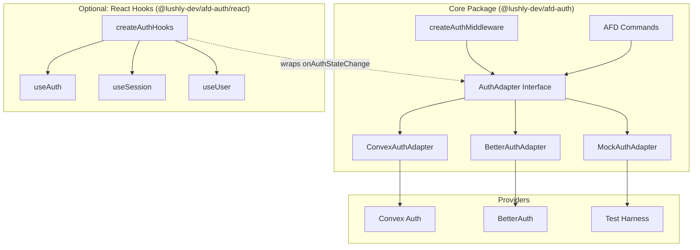

# Auth Adapter Specification

> Provider-agnostic authentication for AFD applications

---
status: in-progress
created: 2026-01-31
updated: 2026-02-21
proposal: [auth-adapter.proposal.md](./auth-adapter.proposal.md)
effort: M (3-5 days)
version: 2.4
---

## Overview

This spec defines `@lushly-dev/afd-auth`, a provider-agnostic authentication adapter using discriminated unions for type-safe session access.

**Strategy:** Use the adapter pattern to abstract authentication providers behind a common interface. Consumers check `status` before accessing `user` — TypeScript enforces this at compile time.

## Architecture



> **Transport integration:** When using HTTP transport, the server must extract the `Authorization` header from incoming requests and populate `context.token` before the auth middleware runs. This can be done via a transport-level hook or a dedicated header-extraction middleware. The stdio transport (IDE/agent) typically uses a different auth model (API keys, session tokens passed in context).

## Package Structure

```
packages/auth/src/
├── index.ts           # Public exports
├── types.ts           # AuthAdapter, AuthSessionState
├── errors.ts          # AuthAdapterError, error codes
├── session-sync.ts    # Multi-tab synchronization
├── commands.ts        # AFD command wrappers
├── middleware.ts      # createAuthMiddleware
├── adapters/
│   ├── convex.ts      # useConvexAuthAdapter()
│   ├── better-auth.ts # useBetterAuthAdapter()
│   └── mock.ts        # MockAuthAdapter (testing)
└── react.ts           # Optional sub-path export (@lushly-dev/afd-auth/react)
```

The main package has **zero React dependency**. React is a thin optional sub-path export via package.json `exports`:

```json
{
  "exports": {
    ".": "./dist/index.js",
    "./react": "./dist/react.js"
  },
  "peerDependencies": {
    "react": "^18.0.0 || ^19.0.0"
  },
  "peerDependenciesMeta": {
    "react": { "optional": true }
  }
}
```

`react.ts` is ~30 lines: a `createAuthHooks(adapter)` factory returning `useAuth`, `useSession`, `useUser`. Each hook wraps `useSyncExternalStore` around the `AuthAdapter.onAuthStateChange` subscription. Consumers import:

```typescript
import { createAuthHooks } from '@lushly-dev/afd-auth/react';
```

## Core Interface

### AuthSessionState (Discriminated Union)

```typescript
export type AuthSessionState =
  | { status: 'unauthenticated'; session: null; user: null }
  | { status: 'loading'; session: null; user: null }
  | { status: 'authenticated'; session: Session; user: User };
```

| Status | `session` | `user` | When Emitted |
|--------|-----------|--------|-------------|
| `unauthenticated` | `null` | `null` | No valid token |
| `loading` | `null` | `null` | Initial load, checking token |
| `authenticated` | valid | valid | Token valid, user loaded |

> **Note:** A `refreshing` status was considered but deferred. All built-in adapters handle refresh transparently — the session stays `authenticated` during background refresh and transitions to `unauthenticated` only on failure. A `refreshing` variant can be added later if a custom adapter needs to surface refresh state to UI.

**Consumer pattern:**
```typescript
const session = useSession();
if (session.status === 'authenticated') {
  console.log(session.user.email);  // TypeScript knows user exists
}
```

### AuthAdapter Interface

```typescript
export interface AuthAdapter {
  signIn(provider: Provider, options?: SignInOptions): Promise<void>;
  signOut(): Promise<void>;
  getSession(): Promise<AuthSessionState>;
  onAuthStateChange(callback: (state: AuthSessionState) => void): { unsubscribe: () => void };
}
```

### Supporting Types

```typescript
export interface Session { id: string; expiresAt: Date; }
// Token is internal to adapter implementations, not part of the public API
export interface User { id: string; email: string; name?: string; image?: string; }
export type Provider = 'github' | 'google' | 'email' | (string & {});

// SignIn options (Zod discriminated union)
const signInOptions = z.discriminatedUnion('method', [
  z.object({
    method: z.literal('credentials'),
    provider: z.literal('email'),
    email: z.string().email(),
    password: z.string().optional(),
  }),
  z.object({
    method: z.literal('oauth'),
    provider: z.string(),
    scopes: z.array(z.string()).optional(),
    redirectTo: z.string().url().optional(),
  }),
]);
export type SignInOptions = z.infer<typeof signInOptions>;
```

### Error Types

```typescript
export type AuthErrorCode =
  | 'INVALID_CREDENTIALS'  // auth-specific: wrong email/password
  | 'TOKEN_EXPIRED'        // from core ErrorCodes
  | 'PROVIDER_ERROR'       // auth-specific: OAuth provider failure
  | 'NETWORK_ERROR'        // from core ErrorCodes
  | 'REFRESH_FAILED';      // auth-specific: token refresh failure
```

**Retryable flags:**

| Error Code | `retryable` | Rationale |
|------------|-------------|-----------|
| `INVALID_CREDENTIALS` | `false` | Wrong input — retrying won't help |
| `TOKEN_EXPIRED` | `true` | Refresh may succeed |
| `PROVIDER_ERROR` | `true` | Transient provider failure |
| `NETWORK_ERROR` | `true` | Transient network failure |
| `REFRESH_FAILED` | `false` | Re-authentication required |

```typescript
export class AuthAdapterError extends Error {
  constructor(public error: { code: AuthErrorCode; message: string; suggestion: string; retryable: boolean });
  static invalidCredentials(): AuthAdapterError;
  static tokenExpired(): AuthAdapterError;
  static providerError(provider: string, details?: string): AuthAdapterError;
  static networkError(): AuthAdapterError;
  static refreshFailed(): AuthAdapterError;
}
```

## Adapter Contracts

| Adapter | Provider API | Requirements |
|---------|--------------|-------------|
| **ConvexAuthAdapter** | `@convex-dev/auth/react` | MUST use `useAuthToken()` + `useAuthActions()`. MUST require `meQuery` option. MUST return synthetic session. MUST emit dev warning for synthetic `expiresAt`. |
| **BetterAuthAdapter** | `better-auth/react` | MUST use `client.useSession()` hook. MUST bridge nanostore to callback. MUST support social + email sign-in. |
| **MockAuthAdapter** | Test harness | MUST start `unauthenticated`. MUST provide `_reset()`, `_setUser()`, `_setLoading()`, `_triggerError()`. SHOULD support configurable delays. |

## AFD Command Wrappers

The adapter is a reactive subscription layer for UI. To complete the AFD story, auth operations are also exposed as commands returning `CommandResult` for agent consumption:

```typescript
import { defineCommand, success, failure } from '@lushly-dev/afd-server';

const authSignIn = defineCommand({
  name: 'auth-sign-in',
  description: 'Sign in via OAuth provider or email credentials',
  category: 'auth',
  tags: ['auth', 'session'],
  input: z.discriminatedUnion('method', [
    z.object({
      method: z.literal('credentials'),
      provider: z.literal('email'),
      email: z.string().email(),
      password: z.string().optional(),
    }),
    z.object({
      method: z.literal('oauth'),
      provider: z.string(),
      scopes: z.array(z.string()).optional(),
      redirectTo: z.string().url().optional(),
    }),
  ]),
  mutation: true,
  executionTime: 'fast',
  errors: ['INVALID_CREDENTIALS', 'PROVIDER_ERROR', 'NETWORK_ERROR'],
  async handler(input, context) {
    const adapter = context.auth as AuthAdapter;
    try {
      await adapter.signIn(input.provider, input);
      return success(
        { provider: input.provider },
        { confidence: 1.0, reasoning: 'Sign-in initiated' },
      );
    } catch (e) {
      if (e instanceof AuthAdapterError) {
        return failure({
          code: e.error.code,
          message: e.error.message,
          suggestion: e.error.suggestion,
          retryable: e.error.retryable,
        });
      }
      throw e;
    }
  },
});
```

| Command | Description | Mutation | Destructive | Expose |
|---------|-------------|----------|-------------|--------|
| `auth-sign-in` | Sign in via provider | Yes | No | palette, agent, cli |
| `auth-sign-out` | Sign out and clear session | Yes | Yes | palette, agent, cli |
| `auth-session-get` | Get current session state | No | No | palette, agent, cli, mcp |

`auth-sign-in` and `auth-sign-out` are `mcp: false` — external agents should not initiate auth flows.

`auth-sign-out` includes `destructive: true` and `confirmPrompt: 'Sign out of your account?'` to prevent accidental sign-outs.

Agents get structured `CommandResult` responses with error codes and suggestions. UI code uses the hooks directly. Both consume the same `AuthAdapter` instance.

## Auth Middleware

Other commands enforce authentication via `createAuthMiddleware`, not by checking auth themselves. This follows the AFD principle: "authorization is orthogonal to capability validation."

```typescript
import type { CommandMiddleware } from '@lushly-dev/afd-core';
import { failure } from '@lushly-dev/afd-server';

export function createAuthMiddleware(
  adapter: AuthAdapter,
  options?: { exclude?: string[] }
): CommandMiddleware {
  return async (commandName, input, context, next) => {
    if (options?.exclude?.includes(commandName)) {
      return next();
    }

    const session = await adapter.getSession();
    if (session.status !== 'authenticated') {
      return failure({
        code: 'UNAUTHORIZED',
        message: 'Authentication required',
        suggestion: 'Sign in first using auth-sign-in',
        retryable: false,
      });
    }

    // Inject authenticated session for downstream handlers
    context.auth = session;
    return next();
  };
}
```

Usage with server:

```typescript
const server = createMcpServer({
  name: 'my-app',
  commands: [todoCreate, todoList, authSignIn, authSignOut, authSessionGet],
  middleware: [
    createAuthMiddleware(adapter, {
      exclude: ['auth-sign-in', 'auth-session-get'],
    }),
  ],
});
```

Commands don't know about auth — middleware handles it. The `exclude` list exempts commands that must work without authentication (sign-in itself, session status checks).

## React Integration (Optional)

React hooks are provided via the optional sub-path export `@lushly-dev/afd-auth/react`. The core package has **zero React dependency**.

### Hooks

```typescript
import { createAuthHooks } from '@lushly-dev/afd-auth/react';

const { useAuth, useSession, useUser } = createAuthHooks(adapter);

// In component:
const session = useSession();
if (session.status === 'authenticated') {
  console.log(session.user.email);
}
```

| Hook | Returns | Purpose |
|------|---------|---------|
| `useAuth()` | `AuthAdapter` | Access adapter for signIn/signOut |
| `useSession()` | `AuthSessionState` | Reactive session with type narrowing |
| `useUser()` | `User \| null` | Convenience accessor |

The factory pattern (`createAuthHooks`) means:
- No global React context needed for simple cases
- The adapter instance is passed explicitly, not via provider
- Other frameworks can implement equivalent hooks in ~20 lines using `onAuthStateChange`

The `AuthProvider` component is optional — only needed if you want to share the adapter via React context across a component tree.

### useSession Contract

| Requirement | Rationale |
|-------------|----------|
| MUST use `useSyncExternalStore` | Tear-free reads across concurrent renders |
| MUST cache ref for stable snapshot | Prevents infinite re-render loops |
| MUST provide server snapshot `{ status: 'loading', ... }` | SSR hydration support |

## Session Sync

Multi-tab synchronization strategy:


### Requirements

- MUST use BroadcastChannel when available (Chrome 54+, Firefox 38+, Safari 15.4+)
- MUST fall back to localStorage `storage` events for older browsers
- MUST implement refresh lock using localStorage timestamp pattern
- MUST handle tab visibility refresh checks

### Timing Constraints

Defaults shown. All values are configurable via `SessionSyncOptions` passed to `createSessionSync()`:

```typescript
export interface SessionSyncOptions {
  lockTimeoutMs?: number;       // default: 10_000
  lockCheckDelayMs?: number;    // default: 50
  debounceIntervalMs?: number;  // default: 100
  visibilityRefreshMs?: number; // default: 300_000 (5 min)
}
```

| Parameter | Default | Rationale |
|-----------|---------|----------|
| Lock timeout | 10 seconds | Prevents stale locks from blocking refresh |
| Lock check delay | 50ms | Double-check pattern for distributed lock |
| Debounce interval | 100ms | Prevents rapid-fire state updates |
| Visibility refresh | 5 minutes | Re-check session when tab becomes visible after this duration |

### Error Handling

| Condition | Behavior |
|-----------|----------|
| Lock acquisition failure | Skip refresh (another tab handling) |
| BroadcastChannel error | Fall back to localStorage silently |
| localStorage unavailable | Disable sync, log warning |

## Implementation Phases

| Phase | Scope | Verification |
|-------|-------|--------------|
| 1 | Core types + errors | `pnpm typecheck` passes |
| 2 | ConvexAuthAdapter | Integration test with OAuth flow |
| 3 | MockAuthAdapter | Unit tests cover all state transitions |
| 4 | Session sync | Multi-tab test: sign-out in Tab A reflects in Tab B within 500ms |
| 5 | React hooks | App consumes auth without adapter coupling |
| 6 | AFD command wrappers | `auth-sign-in`, `auth-sign-out`, `auth-session-get` return CommandResult |
| 7 | BetterAuthAdapter | Swap test - app works unchanged |
| 8 | Documentation | Fresh project integrates via README |

> **Edge runtime** support deferred. No AFD package currently targets edge, and `@convex-dev/auth` compatibility is unverified. When needed, verify zero `node:*` imports in core types and adapter interface.

## Dependencies

```json
{
  "peerDependencies": {
    "@convex-dev/auth": "^0.0.90",
    "better-auth": "^1.0.0",
    "react": "^18.0.0 || ^19.0.0"
  },
  "peerDependenciesMeta": {
    "@convex-dev/auth": { "optional": true },
    "better-auth": { "optional": true },
    "react": { "optional": true }
  }
}
```

## Test Requirements

| Category | Scope | Coverage |
|----------|-------|----------|
| **Unit** | MockAuthAdapter state transitions, subscribe/unsubscribe, error simulation | >90% |
| **Unit** | Type verification via `vitest` `expectTypeOf` for discriminated union | 100% |
| **Integration** | ConvexAuthAdapter renders with ConvexProvider | Pass |
| **Integration** | useSession updates on auth state change | Pass |
| **E2E** | OAuth sign-in flow with route interception | Pass |
| **E2E** | Sign-out clears session, shows sign-in button | Pass |

## Acceptance Criteria

- [ ] TypeScript enforces `status` check before accessing `user` (compile error otherwise)
- [ ] Apps using `@convex-dev/auth` directly need zero migration
- [ ] Provider swap requires only adapter instantiation change
- [ ] `auth-sign-in`, `auth-sign-out`, `auth-session-get` commands return `CommandResult`
- [ ] Multi-tab session sync works across Chrome, Firefox, Safari

---

*Spec Version: 2.4 | Last Updated: 2026-02-21 | Agent-efficient format*
