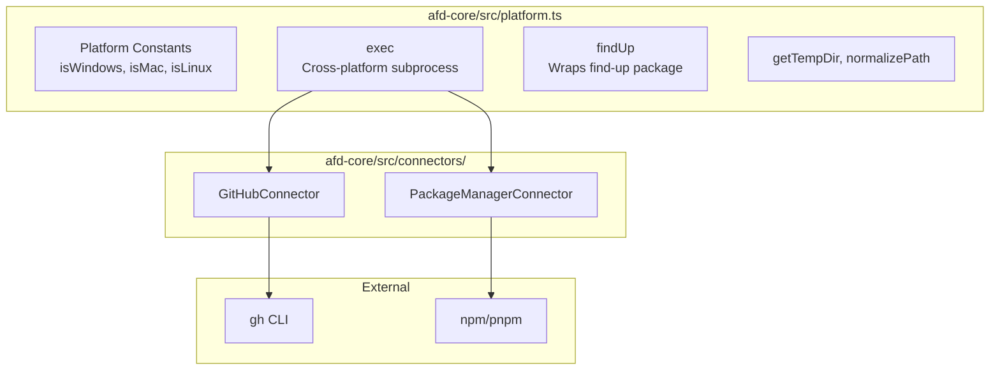

# Spec: Platform Utils

**Proposal:** [platform-utils.proposal.md](./platform-utils.proposal.md)  
**Status:** DRAFT  
**Created:** 2026-01-09  
**Effort:** M (1-3 days)

---

## 1. Overview

Add cross-platform utilities to `@lushly-dev/afd-core` for subprocess execution, path handling, and CLI tool abstraction. This eliminates DRY violations across AFD applications.

### Key Decisions (Resolved)

| Decision | Outcome |
|----------|---------|
| Package location | Add to `afd-core`, extract later if needed |
| findUp() impl | Use `find-up` npm package |
| Debug logging | `debug: boolean` option, logs command (not output) |
| Token protection | GitHubConnector NEVER logs stdout |

---

## 2. Architecture



---

## 3. Data & API

### 3.1 TypeScript Interfaces

```typescript
// packages/core/src/platform.ts

/** Error codes for exec() failures */
export enum ExecErrorCode {
  TIMEOUT = 'TIMEOUT',
  SIGNAL = 'SIGNAL',
  EXIT_CODE = 'EXIT_CODE',
  SPAWN_FAILED = 'SPAWN_FAILED',
}

/** Options for cross-platform exec */
export interface ExecOptions {
  /** Working directory */
  cwd?: string;
  /** Timeout in milliseconds */
  timeout?: number;
  /** Enable debug logging of commands (default: false) */
  debug?: boolean;
  /** Environment variables to merge with process.env */
  env?: Record<string, string>;
}

/** Result from exec() with error codes for observability */
export interface ExecResult {
  /** Standard output (trimmed) */
  stdout: string;
  /** Standard error (trimmed) */
  stderr: string;
  /** Process exit code */
  exitCode: number;
  /** Error code if failed, undefined if success */
  errorCode?: ExecErrorCode;
  /** Duration in milliseconds */
  durationMs: number;
}
```

### 3.2 Connector Interfaces

```typescript
// packages/core/src/connectors/github.ts

export interface IssueCreateOptions {
  title: string;
  body: string;
  repo?: string;
  labels?: string[];
  project?: string;
}

export interface IssueFilters {
  state?: 'open' | 'closed' | 'all';
  label?: string;
  assignee?: string;
  limit?: number;
}

export interface Issue {
  number: number;
  title: string;
  state: 'open' | 'closed';
  url: string;
}

export interface PrCreateOptions {
  title: string;
  body: string;
  head: string;
  base?: string;
  draft?: boolean;
}
```

---

## 4. Implementation

### 4.1 File: `packages/core/src/platform.ts` [NEW]

#### Platform Constants

```typescript
export const isWindows = process.platform === 'win32';
export const isMac = process.platform === 'darwin';
export const isLinux = process.platform === 'linux';
```

#### Function: `exec(cmd, options)`

1. **Validate:** Ensure `cmd` is non-empty array
2. **Log (if debug):** `console.log(\`[exec] ${cmd.join(' ')}\`)`
3. **Start timer:** Record `startTime = Date.now()`
4. **Spawn:**
   - Use `child_process.spawn(cmd[0], cmd.slice(1), opts)`
   - Set `shell: isWindows` for Windows compatibility
   - Merge `options.env` with `process.env`
5. **Collect output:** Buffer stdout and stderr
6. **Handle timeout:** If exceeded, kill process and return `TIMEOUT` error
7. **Handle signal:** If killed by signal, return `SIGNAL` error
8. **Return:**
   ```typescript
   {
     stdout: stdout.trim(),
     stderr: stderr.trim(),
     exitCode: code,
     errorCode: code !== 0 ? ExecErrorCode.EXIT_CODE : undefined,
     durationMs: Date.now() - startTime
   }
   ```

#### Function: `findUp(filename, cwd)`

1. **Import:** `import { findUpSync } from 'find-up'`
2. **Call:** `findUpSync(filename, { cwd: cwd ?? process.cwd() })`
3. **Return:** Result or `null`

#### Function: `getTempDir()`

1. **Import:** `import { tmpdir } from 'os'`
2. **Return:** `tmpdir()`

#### Function: `normalizePath(path)`

1. **Replace:** All `/` and `\` with `path.sep`
2. **Return:** Normalized path

---

### 4.2 File: `packages/core/src/connectors/github.ts` [NEW]

#### Class: `GitHubConnector`

**Constructor:**
```typescript
constructor(private options?: { debug?: boolean })
```

#### Method: `issueCreate(opts)`

1. **Build command:**
   ```typescript
   ['gh', 'issue', 'create', '--title', opts.title, '--body', opts.body]
   ```
2. **Add flags:** `--repo`, `--label`, `--project` if provided
3. **Execute:** `await exec(cmd, { debug: this.options?.debug })`
4. **Parse:** Extract issue number from stdout URL
5. **⚠️ NEVER log stdout** (may contain tokens)
6. **Return:** Issue number

#### Method: `issueList(repo, filters)`

1. **Build command:** `['gh', 'issue', 'list', '--repo', repo, '--json', 'number,title,state,url']`
2. **Add filters:** `--state`, `--label`, `--assignee`, `--limit`
3. **Execute:** `await exec(cmd)`
4. **Parse:** `JSON.parse(result.stdout)`
5. **Return:** Array of `Issue`

---

### 4.3 File: `packages/core/src/connectors/package-manager.ts` [NEW]

#### Class: `PackageManagerConnector`

**Constructor:**
```typescript
constructor(private pm: 'npm' | 'pnpm' = 'npm', private options?: { debug?: boolean })
```

#### Method: `install(pkg?, dev?)`

1. **Build command:** `[this.pm, 'install']`
2. **If pkg:** Append package name
3. **If dev:** Append `--save-dev`
4. **Execute:** `await exec(cmd, { debug: this.options?.debug })`

#### Method: `run(script)`

1. **Build command:** `[this.pm, 'run', script]`
2. **Execute:** `await exec(cmd, { debug: this.options?.debug })`
3. **Return:** `ExecResult`

---

### 4.4 Export from `index.ts`

Add to `packages/core/src/index.ts`:

```typescript
// Platform utilities
export {
  isWindows,
  isMac,
  isLinux,
  exec,
  findUp,
  getTempDir,
  normalizePath,
  ExecErrorCode,
} from './platform.js';
export type { ExecOptions, ExecResult } from './platform.js';

// Connectors
export { GitHubConnector } from './connectors/github.js';
export { PackageManagerConnector } from './connectors/package-manager.js';
export type { 
  IssueCreateOptions, 
  IssueFilters, 
  Issue,
  PrCreateOptions 
} from './connectors/github.js';
```

---

## 5. Test Plan

| Type | Test Case | Location |
|------|-----------|----------|
| Unit | exec() with debug logs command | `platform.test.ts` |
| Unit | exec() returns TIMEOUT on timeout | `platform.test.ts` |
| Unit | exec() returns EXIT_CODE on non-zero | `platform.test.ts` |
| Unit | findUp() finds package.json | `platform.test.ts` |
| Unit | normalizePath() handles mixed separators | `platform.test.ts` |
| Unit | GitHubConnector.issueCreate() builds correct command | `connectors/github.test.ts` |
| Unit | GitHubConnector never logs stdout | `connectors/github.test.ts` |
| Integration | exec(['git', 'status']) succeeds | `platform.integration.test.ts` |
| Integration | GitHubConnector.issueList() returns data | `connectors/github.integration.test.ts` |

### Coverage Targets

- Line coverage: 90%+
- Branch coverage: 100% for error paths

---

## 6. Rollout

### Dependencies to Add

```bash
npm install find-up --save
```

### Rollout Steps

1. Implement Wave 1 (platform.ts)
2. Add tests, verify coverage
3. Implement Wave 2 (connectors)
4. Update index.ts exports
5. Publish to npm

### Rollback

- Code-only change, no data migration
- Revert commit if issues found
- Recovery time: < 5 minutes

---

## 7. Checklist

- [ ] All functions have JSDoc
- [ ] Tests written and passing
- [ ] Coverage > 90%
- [ ] Exported from index.ts
- [ ] Debug logging implemented
- [ ] Token protection verified (GitHubConnector)
- [ ] README updated with examples
